# Java-DesignPatterns

23-DesignPatterns to Java

* [工厂模式](#工厂模式)
* [抽象工厂模式](#抽象工厂模式)
* [单例设计模式](#单例设计模式)
    * [单例设计模式-懒汉模式](#懒汉模式)
        * [多线程Debug分析错误](#多线程Debug分析错误)
    * [单例设计模式-饿汉模式](#饿汉模式)

# <span id="工厂模式">工厂模式</span>

* 只需要传入一个正确的参数，就可以获取你所需要的对象，而无须知道其创建细节。

* 免除客户端直接去创建对象

* 工厂类的职责相对过重，增加新的产品需要修改工厂类的判断逻辑，违背开闭原则。

* 无法实现基于继承的等级结构

基类 Person: 

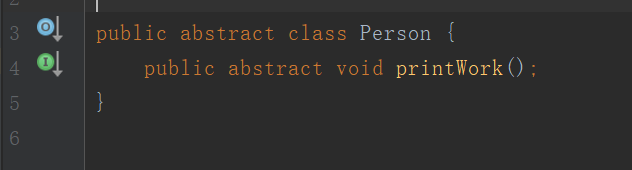

实现:

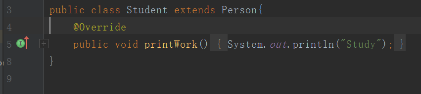

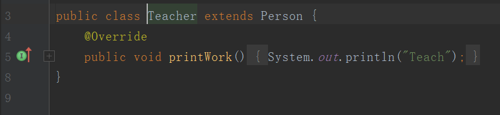

使用工厂创建对象:

```java
public class Test {
    public static void main(String[] args) {
        PersonFactory personFactory = new PersonFactory() ;
        Person person = personFactory.getPerson("student") ;
        person.printWork();
    }
}
```

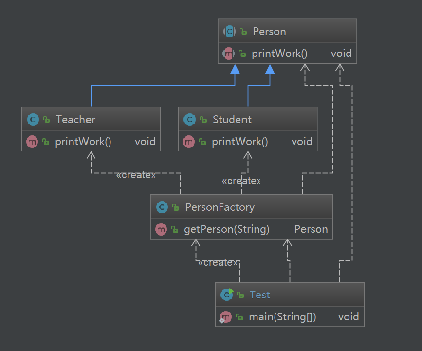

常规创建对象:

```java
public class Test {
    public static void main(String[] args) {
        Person person = new Student() ;
        person.printWork();
    }
}
```

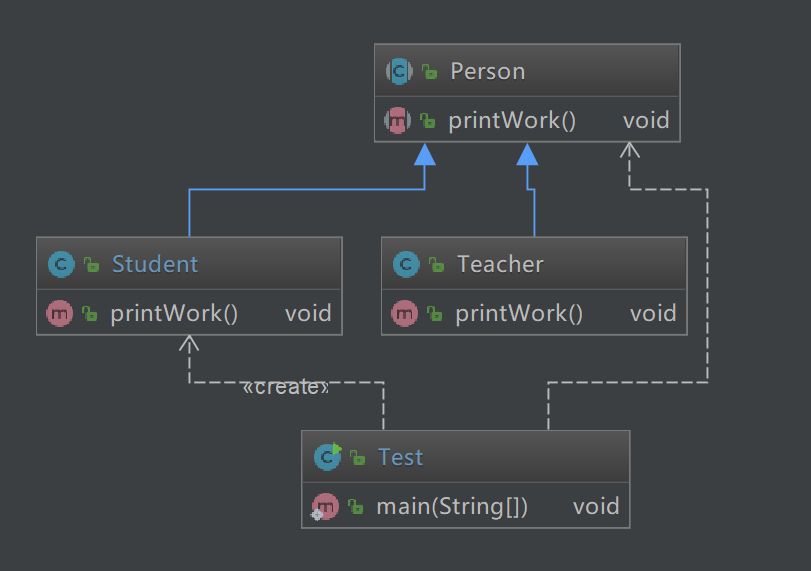

工厂类的设计:

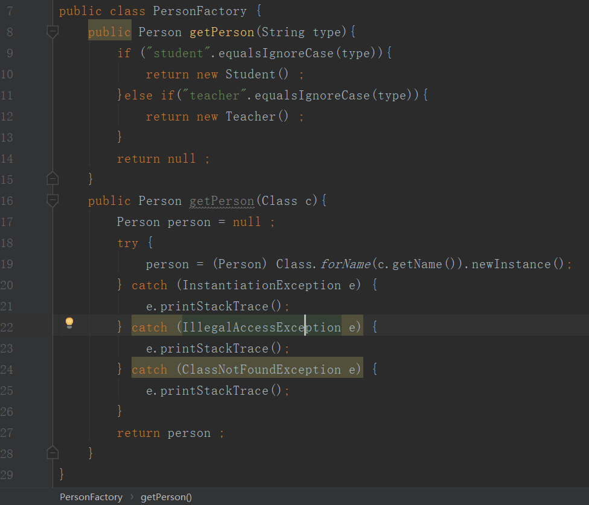

为了遵循开闭原则，工厂类我们需要将其任务由其子类来完成，在添加代码时只需要扩展Factory与Person的子类即可。

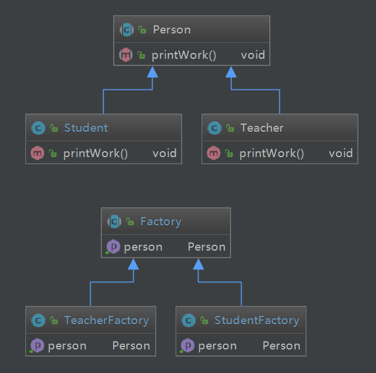

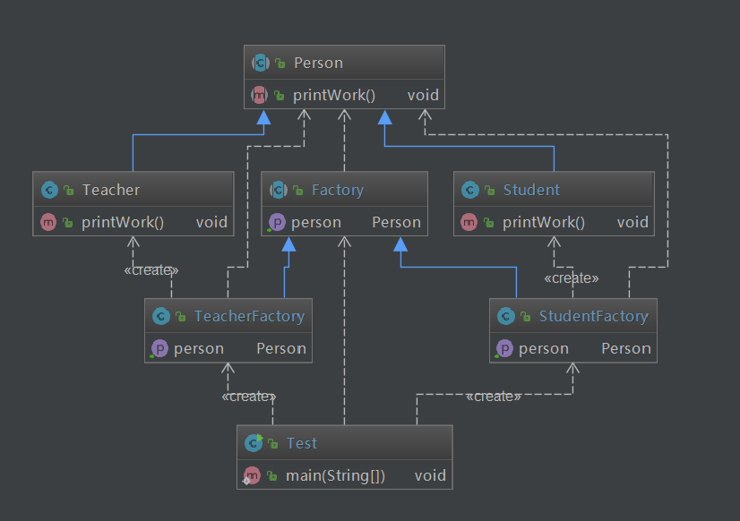

在这种模式下可以在不修改代码的基础上，直接添加Class文件来添加其他类。

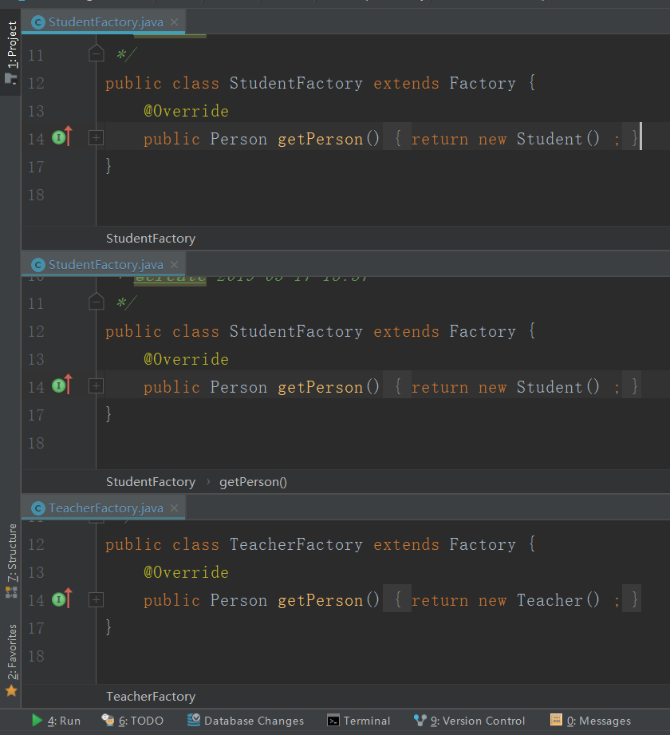

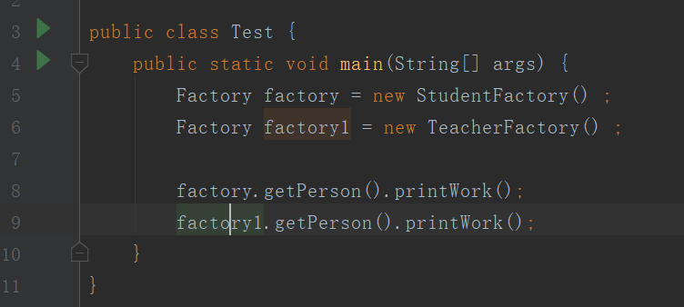

# <span id="抽象工厂">抽象工厂</span>

抽象工厂模式提供一个接口，用于创建相关或依赖对象的家族，而不需要明确指定具体类。可以理解成是多个工厂方法的组合。

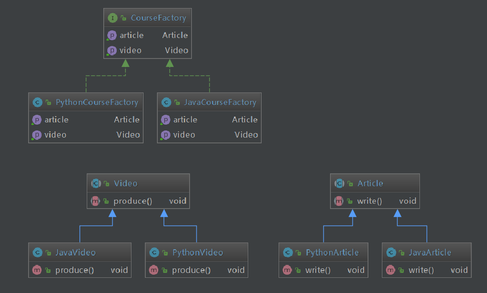

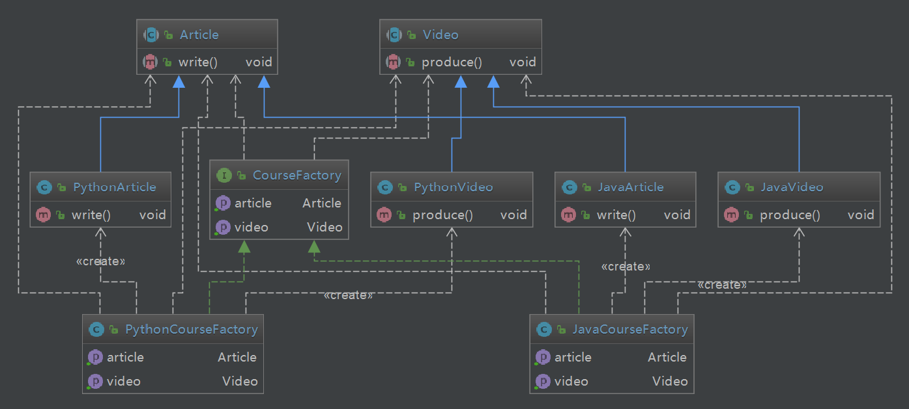

代码:

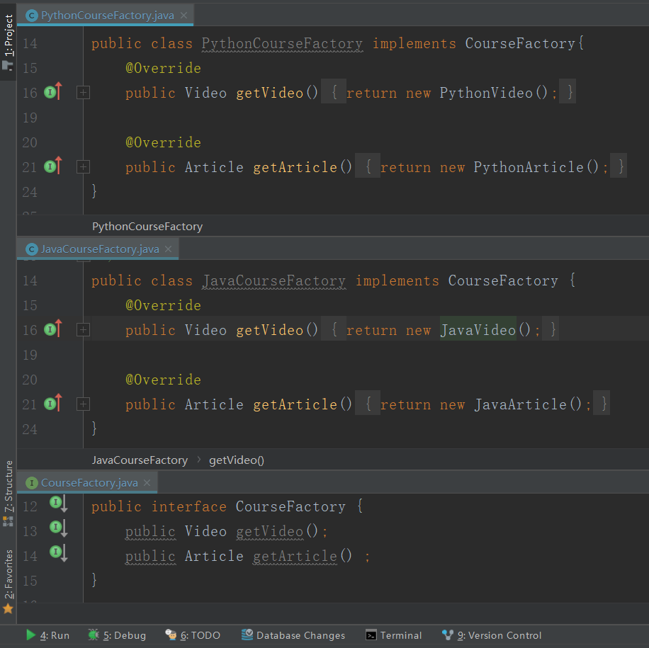
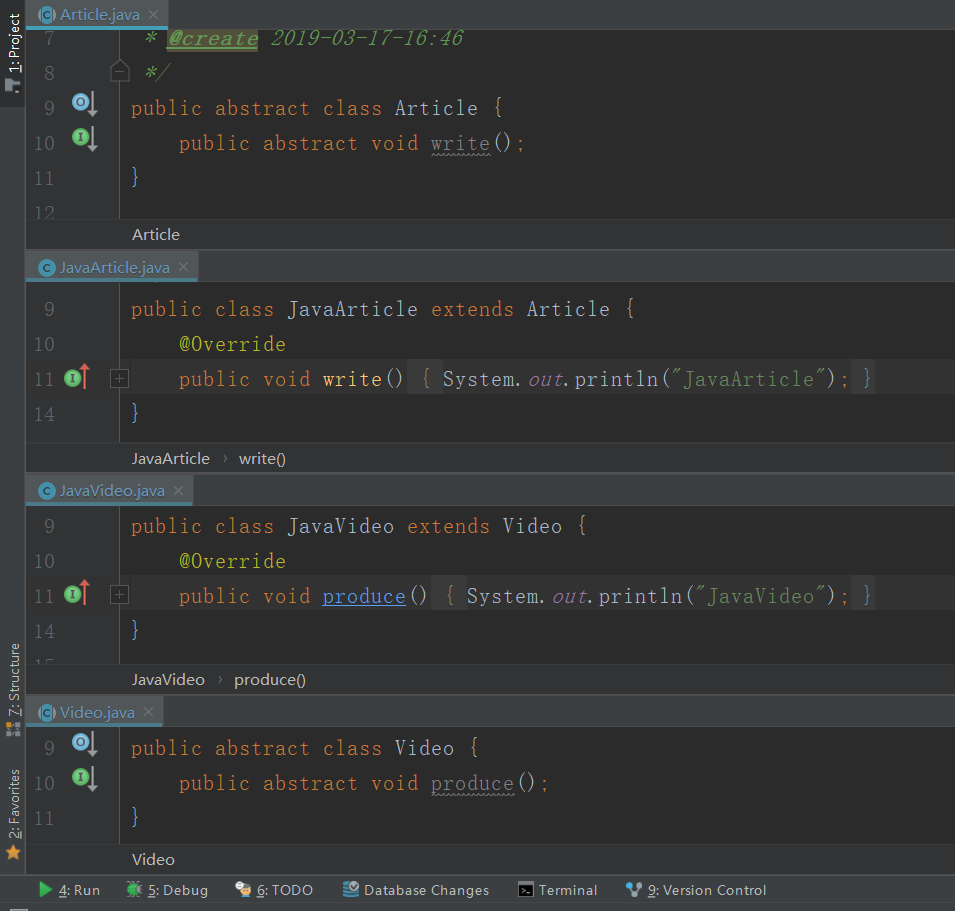

# <span id="单例设计模式">单例设计模式</span>
 
## <span id="懒汉模式">单例设计模式-懒汉模式</span>

单例模式要要点就是一个类只会存在一个实例，要想达到这种效果，最重要的就是将构造方法设置为私有，然后通过static的方法来获取对象。

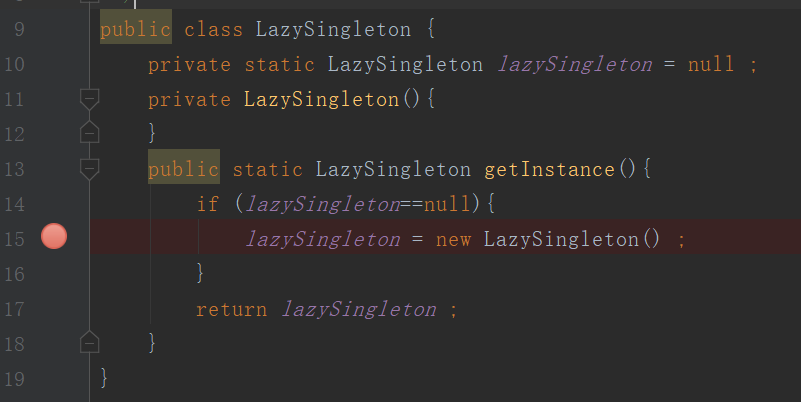

## <span id="多线程Debug分析错误">多线程Debug分析错误</span>

上述设计并不线程安全，因为在`lazySingleton = new LazySingletion()`这一步可能会发送线程的切换，导致出现多个lazySingletion对象。

可以通过多线程Debug来测试。

线程类:

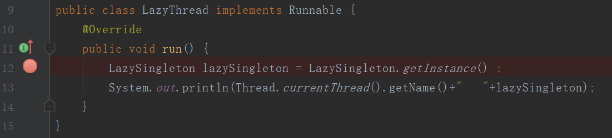

测试类:


在多线程Debug时需要在断点处勾选`Thread`。

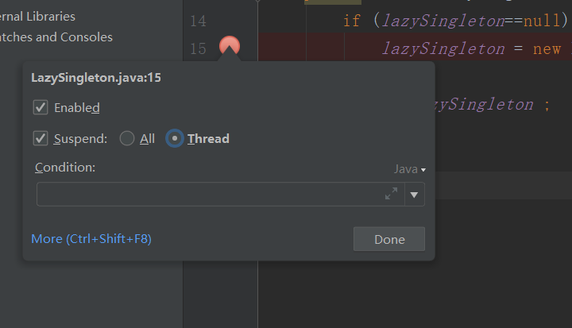

之后开始Debug。

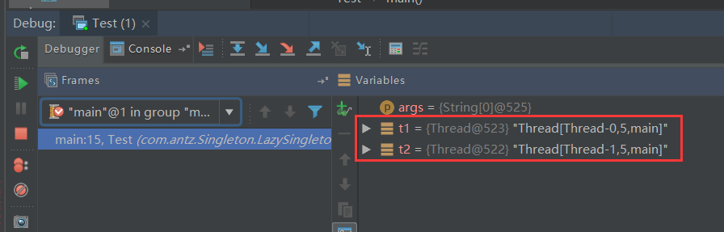

开始时创建了两个LazyThread线程对象。

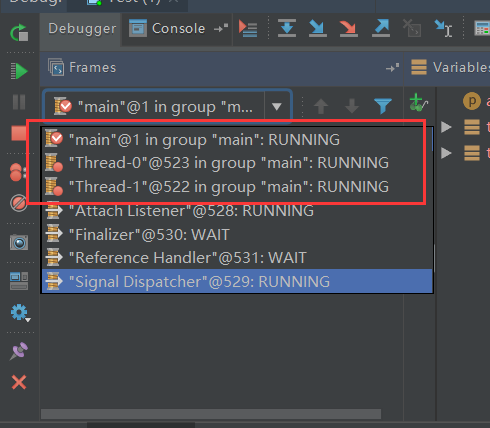

可以看到目前有三个进程，`Main`,`Thread-0`,`Thread-1`。

我们切换至`Thread-0`将此线程执行到LazySingleton对象创建处。

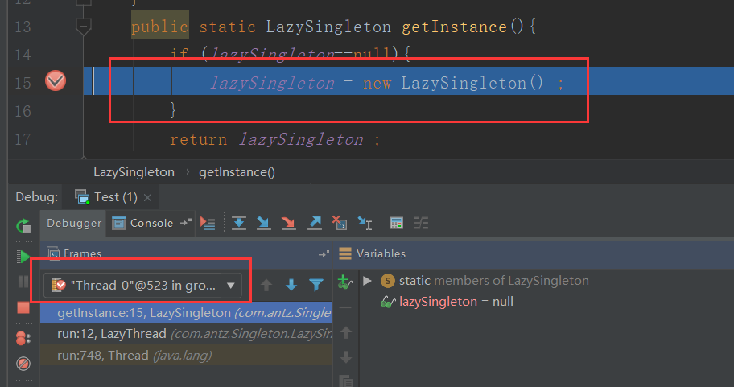

此时lazySingleton还没有实例化，为null，所以`Thread-1`也可以通过if判断进入其中。我们将`Thread-1`线程也执行至此处。

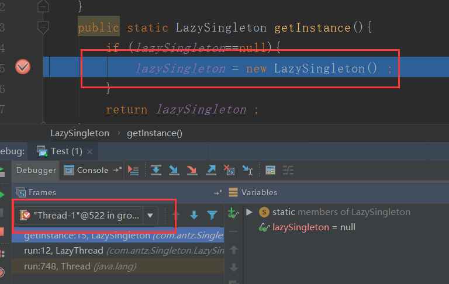

接下来的顺序就无所谓了，两个线程都会去自己实例化lazySingleton对象。

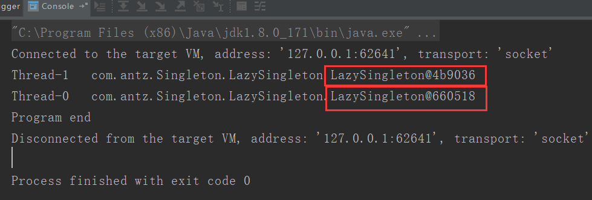

执行完成后通过打印发现lazySingleton对象其实不是同一个。

如果我们正常运行呢？

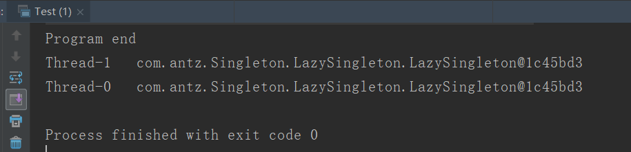

可以发现大部分情况下都会时同一个lazySingleton对象。

为了保证线程安全性，可以通过`synchronized`来修饰getInstance方法。

至于这种情况下的调试，在`Thread-0`进入`synchronized`块中时，切换至`Thread-1`会发现无法进入。

但是`synchronized`是重量级锁，使用它对我们程序的性能会有很大的影响，所以我们可以使用`双重验证`+`synchronized`的方法来创建单例。

```java
public class LazySingleton {
    private static LazySingleton lazySingleton = null ;
    private LazySingleton(){
    }
    public synchronized static LazySingleton getInstance(){
        if (lazySingleton==null){
            lazySingleton = new LazySingleton() ;
        }
        return lazySingleton ;
    }
    public synchronized static LazySingleton getInstance(){
        if (lazySingleton==null){
            synchronized (LazySingleton.class){
                if (lazySingleton==null){
                    lazySingleton = new LazySingleton();
                }
            }
        }
        return lazySingleton ;
    }   
}
```

这种方法看上去没有什么问题，可以提高效率，但是在`lazySingleton = new LazySingleton();`处，可能Jvm会对此处指令重排。

正常来说是先初始化该对象地址，再将lazySingleton指向该地址。

所以当一个线程进入锁后，在初始化lazySingleton时，没有先初始化该对象内存地址，而是先将lazySingleton指向分配的地址，会导致`lazySingleton!=null`，然后直接执行`return lazySingleton;` ，要解决这个问题，可以将`lazySingleton`添加关键字`volatile`。

## <span id="饿汉模式">单例设计模式-饿汉模式</span>

饿汉式的要点就是在创建实例时完成对象的初始化。

```java
public class HungrySingleton {
    private static HungrySingleton hungrySingleton = null ;
    static {
        hungrySingleton = new HungrySingleton() ;
    }
    public static HungrySingleton getInstance(){
        return hungrySingleton ;
    }
}
```

利用静态代码块来将该类在加载时完成初始化。

# 享元模式

应用于系统底层的开发，以便解决系统的性能问题，适用于系统有大量相似对象，需要缓冲池的场景。

优点: 减少对象的创建，降低内存中对象的数量，降低系统的内存，提高效率。减少内存之外的其他资源占用。

缺点: 关注内/外部状态，关注线程安全问题。使系统逻辑复杂化。